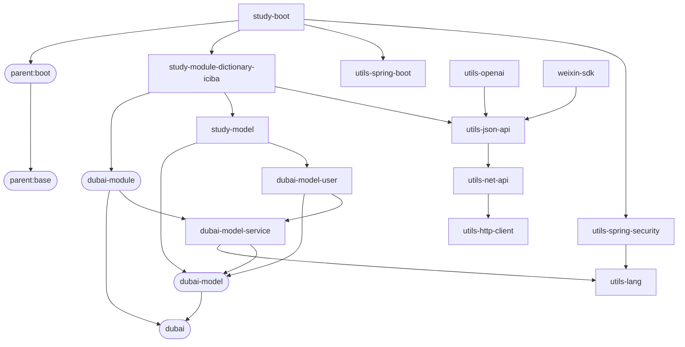

# 我的项目汇总

* [parent:v1.3.0](https://github.com/dbstar-org/parent)
* [utils-lang:v1.0.9](https://github.com/dbstar-org/utils-lang)
* [utils-spring-boot:v1.0.7](https://github.com/dbstar-org/utils-spring-boot)
* [utils-spring-security:v1.0.3](https://github.com/dbstar-org/utils-spring-security)
* [utils-http-client:v1.1.1](https://github.com/dbstar-org/utils-http-client)
* [utils-net-api:v1.1.4](https://github.com/dbstar-org/utils-net-api)
* [utils-json-api:v1.1.8](https://github.com/dbstar-org/utils-json-api)
* [dubai:v1.1.3-SNAPSHOT](https://github.com/dbstar-org/dubai)
* [dubai-model-user:v1.0.4-SNAPSHOT](https://github.com/dbstar-org/dubai-model-user)
* [study-model:v1.0.0-SNAPSHOT](https://github.com/dbstar-org/study-model)
* [study-module-dictionary-iciba:v1.0.3-SNAPSHOT](https://github.com/dbstar-org/study-module-dictionary-iciba)
* [study-boot:v1.0.2-SNAPSHOT](https://github.com/dbstar-org/study-boot)
* [utils-openai:v1.0.0-SNAPSHOT](https://github.com/dbstar-org/utils-openai)
* [weixin-sdk:v1.0.3](https://github.com/dbstar-org/weixin-sdk)

依赖关系：

