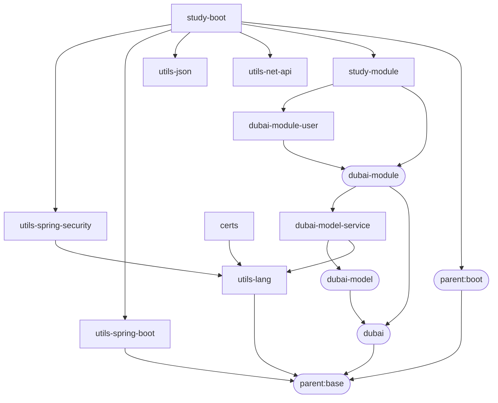

# 我的项目汇总

* [parent:v1.2.9](https://github.com/dbstarll/parent)
* [utils-lang:v1.0.6](https://github.com/dbstarll/utils-lang)
* [utils-spring-boot:v1.0.6](https://github.com/dbstarll/utils-spring-boot)
* [dubai:v1.0.1](https://github.com/dbstarll/dubai)
* [dubai-module-user:v1.0.2](https://github.com/dbstarll/dubai-module-user)
* [study-module:v1.0.2](https://github.com/dbstarll/study-module)
* [study-boot:v1.0.2-SNAPSHOT](https://github.com/dbstarll/study-boot)

依赖关系：

