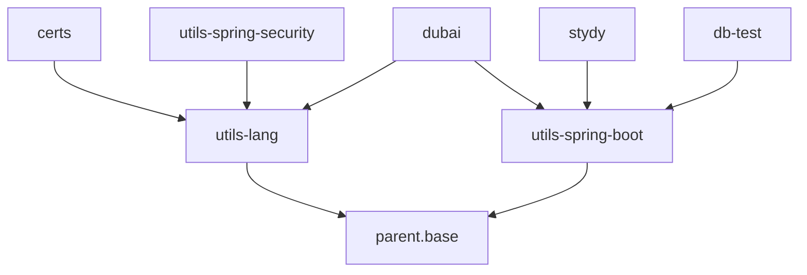

# 我的项目汇总

* [parent](https://github.com/dbstarll/parent)
* [utils-lang](https://github.com/dbstarll/utils-lang)
* [utils-spring-boot](https://github.com/dbstarll/utils-spring-boot)

依赖关系：

```mermaid
graph TD;
    utils-lang-->parent.base;
    certs-->utils-lang;
    dubai-->utils-lang;
    utils-spring-security-->utils-lang;

    utils-spring-boot-->parent.base;
    stydy-->utils-spring-boot;
    dubai-->utils-spring-boot;
    db-test-->utils-spring-boot;
```

